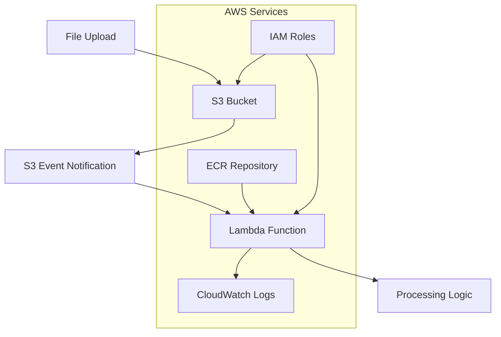

# Architecture Overview

## System Architecture

The S3 Event-Driven Lambda system consists of the following components:



## Components

### 1. S3 Bucket
- **Purpose**: Storage for uploaded files
- **Configuration**: 
  - Versioning enabled
  - Server-side encryption (AES256)
  - Public access blocked
  - Event notifications configured

### 2. Lambda Function
- **Type**: Container-based Lambda
- **Runtime**: Python 3.11
- **Trigger**: S3 ObjectCreated events
- **Memory**: 256 MB (configurable)
- **Timeout**: 30 seconds (configurable)

### 3. IAM Roles and Policies
- **Lambda Execution Role**: 
  - CloudWatch Logs permissions
  - S3 GetObject permissions
  - Basic Lambda execution permissions

### 4. CloudWatch Logs
- **Log Group**: `/aws/lambda/s3-event-processor`
- **Retention**: 14 days (configurable)
- **Purpose**: Store Lambda execution logs

### 5. ECR Repository
- **Purpose**: Store Lambda container images
- **Lifecycle**: Managed by GitHub Actions

## Data Flow

1. **File Upload**: User/application uploads file to S3 bucket
2. **Event Generation**: S3 generates ObjectCreated event
3. **Lambda Trigger**: S3 event triggers Lambda function
4. **Processing**: Lambda processes event and logs filename
5. **Logging**: Execution details logged to CloudWatch

## Security Model

### IAM Permissions

#### Lambda Execution Role
```json
{
  "Version": "2012-10-17",
  "Statement": [
    {
      "Effect": "Allow",
      "Action": [
        "logs:CreateLogGroup",
        "logs:CreateLogStream",
        "logs:PutLogEvents"
      ],
      "Resource": "*"
    },
    {
      "Effect": "Allow",
      "Action": [
        "s3:GetObject",
        "s3:GetObjectVersion"
      ],
      "Resource": "arn:aws:s3:::bucket-name/*"
    }
  ]
}
```

#### S3 Lambda Permission
```json
{
  "Effect": "Allow",
  "Principal": {
    "Service": "s3.amazonaws.com"
  },
  "Action": "lambda:InvokeFunction",
  "Resource": "arn:aws:lambda:region:account:function:function-name",
  "Condition": {
    "StringEquals": {
      "AWS:SourceAccount": "account-id"
    }
  }
}
```

## Scalability Considerations

### Lambda Scaling
- **Concurrent Executions**: Up to 1000 (default)
- **Burst Concurrency**: 500-3000 (region dependent)
- **Duration**: Suitable for quick processing tasks

### S3 Event Handling
- **Event Rate**: Can handle high-frequency uploads
- **Batch Processing**: Single Lambda invocation per S3 event
- **Retry Logic**: Built-in retry mechanism for failed invocations

## Monitoring and Observability

### CloudWatch Metrics
- `Duration`: Function execution time
- `Invocations`: Number of function invocations
- `Errors`: Number of function errors
- `Throttles`: Number of throttled invocations

### Custom Metrics
```python
import boto3

cloudwatch = boto3.client('cloudwatch')

# Custom metric example
cloudwatch.put_metric_data(
    Namespace='S3EventProcessor',
    MetricData=[
        {
            'MetricName': 'ProcessedFiles',
            'Value': 1,
            'Unit': 'Count'
        }
    ]
)
```

### Alarms
- Error rate > 5%
- Duration > 25 seconds
- Throttles > 0

## Error Handling

### Lambda Function
```python
def lambda_handler(event, context):
    try:
        # Processing logic
        pass
    except Exception as e:
        logger.error(f"Processing failed: {str(e)}")
        # Send to DLQ or SNS for alerts
        raise e
```

### Dead Letter Queue (Optional)
- Configure DLQ for failed Lambda invocations
- Send failed events to SQS or SNS for manual processing

## Performance Optimization

### Lambda Function
1. **Cold Start Optimization**:
   - Minimize dependencies
   - Use provisioned concurrency for consistent performance
   - Optimize container image size

2. **Memory Allocation**:
   - Monitor memory usage
   - Right-size memory allocation
   - Consider CPU-to-memory ratio

3. **Processing Efficiency**:
   - Stream processing for large files
   - Asynchronous operations where possible
   - Connection pooling for external services

### S3 Configuration
1. **Event Filtering**:
   - Use prefix/suffix filters to reduce unnecessary invocations
   - Filter by object size if needed

2. **Transfer Acceleration**:
   - Enable for faster uploads from distant locations

## Cost Analysis

### Lambda Costs
- **Requests**: $0.20 per 1M requests
- **Duration**: $0.0000166667 per GB-second
- **Typical cost**: ~$0.0001 per invocation (256MB, 100ms)

### S3 Costs
- **Storage**: $0.023 per GB/month (Standard)
- **Requests**: $0.0004 per 1,000 PUT requests
- **Data Transfer**: First 1GB free, then $0.09 per GB

### CloudWatch Costs
- **Log Ingestion**: $0.50 per GB
- **Log Storage**: $0.03 per GB/month
- **Metrics**: First 10 metrics free

## Disaster Recovery

### Backup Strategy
- S3 versioning enabled
- Cross-region replication (optional)
- Lambda function code in version control

### Recovery Procedures
1. **Lambda Function**: Redeploy from ECR image
2. **S3 Bucket**: Restore from versioned objects
3. **Configuration**: Recreate via Terraform

## Future Enhancements

### Potential Improvements
1. **Batch Processing**: Process multiple files in single invocation
2. **Event Filtering**: More sophisticated filtering logic
3. **Parallel Processing**: Fan-out pattern for complex processing
4. **Content Analysis**: Add file content validation and processing
5. **Notification System**: SNS notifications for processing status
6. **Metrics Dashboard**: Custom CloudWatch dashboard